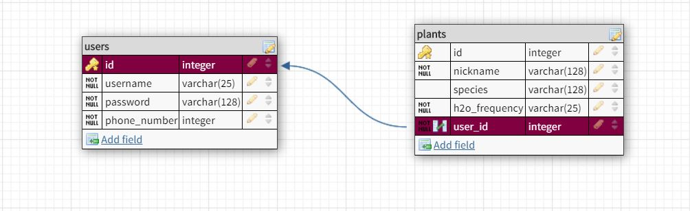

# back_end

## Getting Started Locally:
1. Clone this repository
1. Run **npm i** from root directory
1. Run **npm run server** to start the server on your machine (will be running on port 5000)
 * Be sure to have this server running when trying to test your React app.

## Endpoints:
* Example endpoint would be: *localhost:5000/api/users*

#### Register/Login/Logout Endpoints

| Action | Endpoint | Description
|---|---|---|
| POST | `/api/auth/register` | Creates a new user |
| POST | `/api/auth/login` | Allows user to login and returns token |
| GET | `/api/auth/logout` | Destroys current session and logs a user out |

#### Shape of User Required to Register (JSON):
```
{
  "username": "BrandonSanderson",
  "password": "AuthorMan2020",
  "phone_number": 1234567890
}
```

#### Shape of User Required to Login (JSON):
```
{
  "username": "BrandonSanderson",
  "password": "AuthorMan2020"
}
```

#### User Endpoints

| Action | Endpoint | Description
|---|---|---|
| GET | `/api/users` | If user is logged in, returns an array of all other users |
| GET | `/api/users/:id` | If user is logged in, returns the user with the specified ID |
| GET | `/api/users/:id/plants` | Retrieves list of user's plants and plant info |
| PUT | `/api/users/:id` | Edits user with specified ID |
| DELETE | `/api/users/:id` | Deletes user with specified ID |

##### NOTE: To access any of these user endpoint, you will need token authentication, which can be passed after a user login is performed.
  * Example:
  ```
  const loginHandler = e => {
    e.preventDefault();
    axiosWithAuth()
      .post('/api/auth/login', userCred)
      .then(res => {
        window.localStorage.setItem('token', res.data.token);
      })
      .catch(err => console.log(err));
  };
  ```

#### Plant Endpoints

| Action | Endpoint | Description
|---|---|---|
| GET | `/api/plants` | If user is logged in, returns an array of all plants (theirs and those of other users) |
| GET | `/api/plants/:id` | If user is logged in, returns the plant with the specified ID |
| POST | `/api/plants/` | Adds a plant to currently logged in user |
| PUT | `/api/plants/:id` | Edits plant with specified ID |
| DELETE | `/api/plants/:id` | Deletes plant with specified ID |

#### Overall Shape of Plant (JSON):
```
{
  "nickname": "Rose",
  "species": "Rosidopidus", <-- NOT A REQUIRED FIELD
  "h2o_frequency": "Once Daily",
  "user_id": 1
}
```

## Database Schema:

